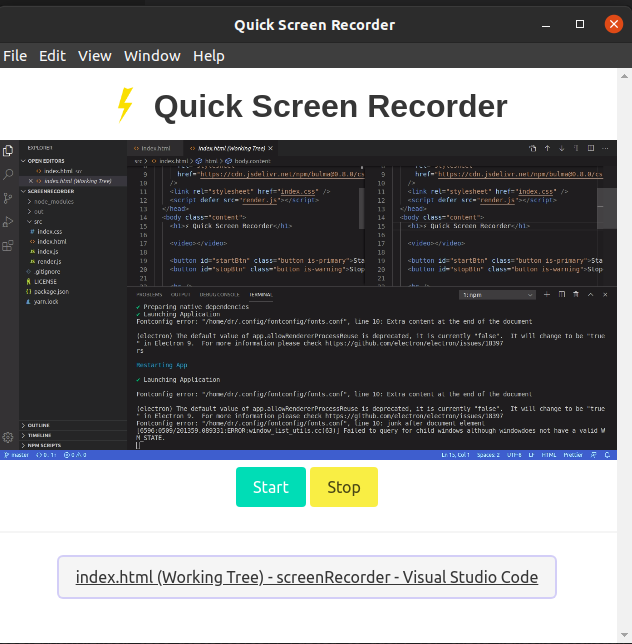

# Screen Recorder
Quick native application for recording screen based on electronJs and electron forge

## develop
npm start

## build
npm run make
it will create the native application on the platform on which it is run
